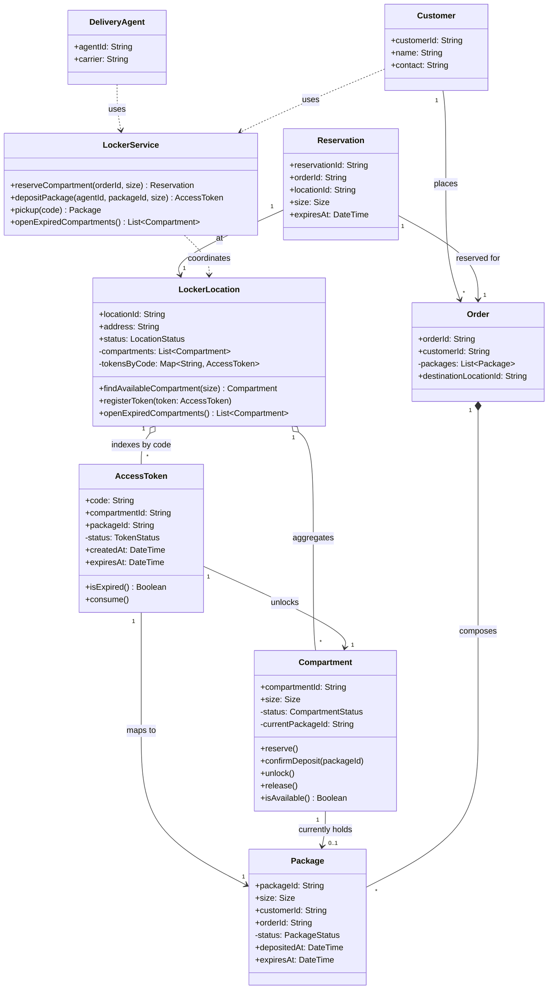
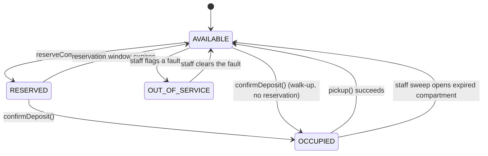
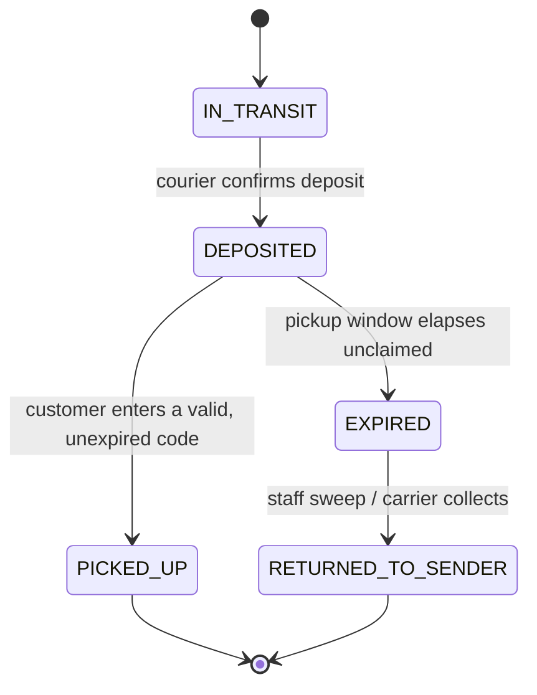
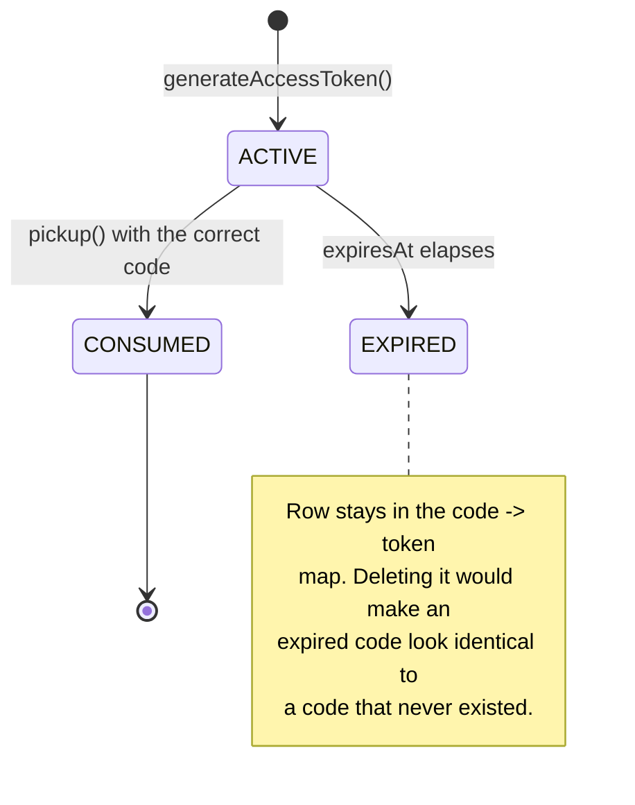
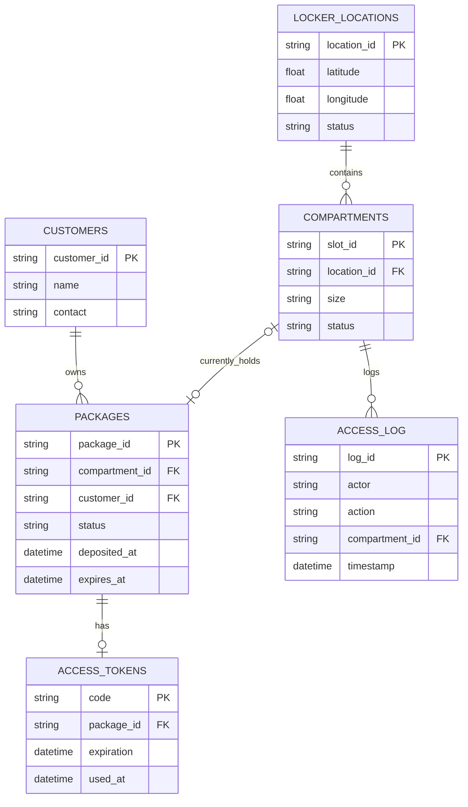
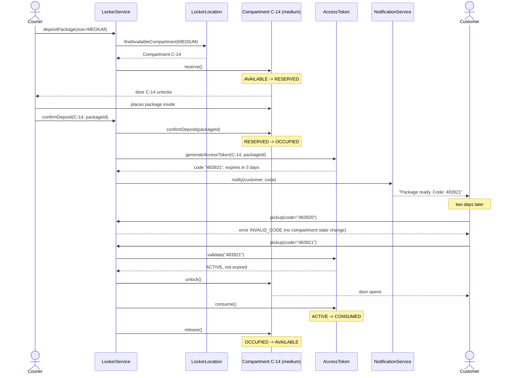
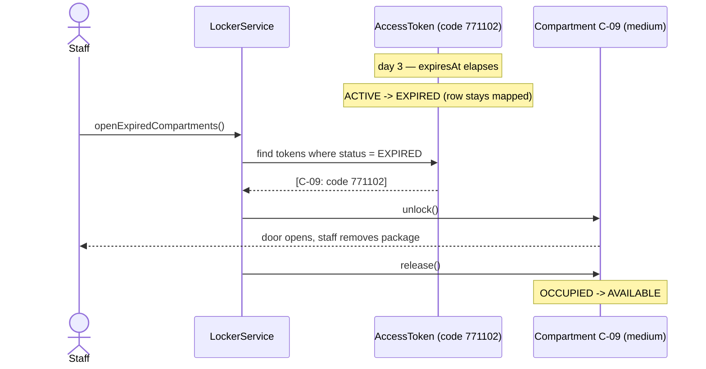

<SectionTracker
  sections={["Problem Framing", "Core Content", "Trade-offs", "Worked Example", "Interview Angle", "Practice & Self-Check"]}
  active="Problem Framing"
/>

## Problem framing

Zoom in to a single locker station: one bank of compartments bolted to a
wall in an apartment lobby or grocery store, with no knowledge of any
other station in the network. A courier walks up with a package. The
station has to find a compartment the package actually fits in, lock it
shut, and hand the courier a way to prove deposit happened. Later, a
customer walks up with a code. The station has to prove that code opens
the one compartment it was issued for, and only that one, and only once.

Three actors touch this station:

- **Courier** — deposits a package, needs the right size compartment and
  a receipt that a deposit happened.
- **Customer** — retrieves a package with a code, needs a clear
  accept/reject decision, not an ambiguous one.
- **Ops/staff** — handles the exception path: packages nobody ever picked
  up.

This is a **resource-allocation-with-a-lease** problem: a fixed pool of
interchangeable-within-a-size-class resources (compartments), each
handed out under a lease with an expiration (the pickup window), and
reclaimed either by normal return (customer picks up) or by the lease
timing out (staff sweep). A parking garage assigning spots to cars, or a
hotel assigning rooms to guests for a fixed stay, are the same shape —
if you can design one, the class structure of the others follows the
same skeleton: an aggregate that owns a pool of slots, a slot that owns
its own occupancy, and a token that proves the right to release one.

Payment for locker rental, a full account/auth system, the internals of
how a notification actually gets delivered (SMS vs push vs email), and
lockout-after-repeated-wrong-codes are all out of scope here — they're
either handled by a service this design calls into, or worth naming as
an extension rather than building out.

## Requirements at the object level

Three operations, stated precisely enough to drive class design:

- **`depositPackage(size, courierId)`** — given a package size, find an
  `AVAILABLE` compartment of that exact size, mark it occupied, generate
  a unique access code tied to that compartment and that package, return
  the code (or a "no capacity" error if none exists).
- **`pickup(code)`** — given a code, look up its access token in O(1) (not
  a scan over every compartment), reject if the token doesn't exist, is
  expired, or was already used, otherwise unlock the mapped compartment,
  free it, and invalidate the token.
- **`openExpiredCompartments()`** — the staff-sweep path: enumerate every
  compartment whose access token has expired without being consumed, and
  force them open.

Non-functional requirements that shape the classes, not just the
behavior: compartment state changes must be **thread-safe at the
per-compartment level** (two couriers should never both win a reserve on
the same slot), code lookup should be close to O(1) even as the number
of issued tokens grows, and the size-matching and assignment logic
should be swappable without touching the deposit workflow — a new
compartment size or a smarter assignment rule shouldn't mean rewriting
`depositPackage()`.

## Core content

### Class diagram

{/* concept-dependency: LLD-01 not yet built, explained inline */}
{/* concept-dependency: LLD-02 not yet built, explained inline */}

Two ideas from object-oriented design (normally covered in the OOP
Fundamentals and Class Relationships concept lessons) drive the shape
below. First, **encapsulation as "information expert"**: a `Compartment`
knows whether it's occupied better than anything else could, so it
should own that state and the methods that change it, rather than some
other object holding a parallel record of "which compartments are
occupied" that can drift out of sync. Second, **composition vs
association**: `LockerLocation` *owns* its `Compartment`s (they don't
exist without a location — composition), while an `AccessToken`
*references* a `Compartment` and a `Package` without owning either
(association) — the token can expire and disappear without deleting the
compartment underneath it.

<DiagramPanel title="Amazon Locker — object model" type="class">

</DiagramPanel>

`LockerLocation` is the aggregate root: every operation on a
`Compartment` or `AccessToken` goes through it (or through
`LockerService`, which delegates to it), so nothing outside this station
mutates a compartment directly. `Reservation` is optional — it exists to
support "reserve a slot before the courier physically arrives," e.g. an
e-commerce order that wants to guarantee capacity at checkout time; a
walk-up courier with no prior reservation skips straight to
`depositPackage()`.

<QuizItem
  question="Why does AccessToken reference exactly one Compartment and one Package — a single field each, not a list?"
  answer="Because the invariant is 1:1: one active code opens exactly one compartment holding exactly one package. Modeling the reference as a single field (not a collection) makes that invariant impossible to violate in the type itself, rather than merely true by convention that calling code has to maintain."
/>

### State machines

{/* concept-dependency: LLD-04 not yet built, explained inline */}

Three objects change state over their lifetime, and a state machine
(normally covered in the UML Diagrams concept lesson, which introduces
state diagrams as one of UML's five core diagram types alongside class
and sequence diagrams) is the right tool because each one has more than
one way to leave its current state — the diagram forces you to draw
every exit, not just the happy one.

<DiagramPanel title="Compartment lifecycle" type="state">

</DiagramPanel>

<DiagramPanel title="Package lifecycle" type="state">

</DiagramPanel>

<DiagramPanel title="AccessToken lifecycle" type="state">

</DiagramPanel>

The nuance worth calling out explicitly: an `EXPIRED` token is not
deleted. `pickup("771102")` for a code that expired yesterday still
finds a row — it just fails the "not expired" check and returns a
specific `CODE_EXPIRED` error. A code that was never issued finds no row
at all and returns `INVALID_CODE`. Collapsing those two into the same
"not found" response is a common shortcut that breaks both good error
messages for the customer and `openExpiredCompartments()`, which relies
on being able to *enumerate* expired-but-unconsumed tokens — you can't
enumerate rows you already deleted.

<QuizItem
  question="Why must an EXPIRED AccessToken stay in the location's code-to-token map instead of being deleted once it expires?"
  answer="So a later lookup can distinguish 'this code is expired' (found, but the expiry check fails) from 'this code never existed' (not found at all) — deleting it would collapse both into the same not-found error. Staff sweep also depends on scanning the map for expired-but-unconsumed tokens; a deleted row can't be enumerated."
/>

### Design patterns

{/* concept-dependency: LLD-06 not yet built, explained inline */}
{/* concept-dependency: LLD-07 not yet built, explained inline */}
{/* concept-dependency: LLD-08 not yet built, explained inline */}
{/* concept-dependency: LLD-08b not yet built, explained inline */}

Six patterns (plus one technique that isn't formally a Gang-of-Four
pattern) do real work in this design rather than being decoration:

- **State** — `Compartment.status` is an explicit enum
  (`AVAILABLE`/`RESERVED`/`OCCUPIED`/`OUT_OF_SERVICE`) with methods that
  enforce legal transitions, instead of a loose `boolean isOccupied`
  flag plus `if/else` checks scattered across the codebase. The state
  diagram above *is* this pattern's contract.
- **Strategy** — compartment assignment (exact-size-match only, today) is
  swapped in behind a `CompartmentAssignmentStrategy` interface rather
  than hard-coded inside `depositPackage()`. Notification-channel
  selection (SMS vs push vs email) is a second natural fit for the same
  pattern, even though the notification internals themselves are out of
  scope here.
- **Facade** — `LockerService` is the single entry point for couriers and
  customers. It hides the multi-step choreography (`reserve()` ->
  physical deposit -> `confirmDeposit()` -> `generateAccessToken()` ->
  notify) behind two calls: `depositPackage()` and `pickup()`. No caller
  outside this class needs to know that order exists.
- **Repository** — persistence for `Compartment`, `Package`, and
  `Customer` sits behind a repository interface
  (`CompartmentRepository.findAvailable(locationId, size)`, etc.), so
  the in-memory or SQL implementation underneath can change without
  `LockerService` noticing.
- **Observer** — when a `Package` moves to `DEPOSITED`, interested
  parties (a `NotificationService`) subscribe rather than
  `LockerService` calling a hard-coded `sendSms()`. The full
  notification pipeline is out of scope for this lesson, but the hook
  point is worth naming: it's the seam where that system plugs in later
  without touching deposit logic.
- **Factory** — `generateAccessToken(compartmentId, packageId)` is a
  factory method: it encapsulates "generate a code, compute its
  expiration from the pickup-window policy, and attach both
  references" as one atomic construction step, so no caller can produce
  a token missing one of those three pieces.
- **Two-phase-commit-style workflow (not a GoF pattern, but a technique
  worth naming)** — `reserve()` then `confirmDeposit()` are two separate
  calls, not one atomic `markOccupied()`. `reserve()` flips
  `AVAILABLE -> RESERVED` and physically unlocks the door;
  `confirmDeposit()` only flips `RESERVED -> OCCUPIED` once the courier
  app confirms the package is actually inside. If the courier's app
  crashes or the network drops between those two calls, the compartment
  sits in `RESERVED` (with its own timeout back to `AVAILABLE`) instead
  of being permanently marked `OCCUPIED` with nothing inside it.

<QuizItem
  question="Facade vs. having the courier's client code call Compartment.reserve() and generateAccessToken() directly — why route everything through LockerService?"
  answer="LockerService is what knows the four-step order — reserve, confirm deposit, generate token, notify — has to happen in. Without a facade, every caller has to independently know and correctly sequence four separate objects, and any one caller getting the order wrong (e.g. generating a token before confirmDeposit() commits) breaks the two-phase-deposit invariant."
/>

### Database design

{/* concept-dependency: LLD-05 not yet built, explained inline */}

The schema below is the persisted form of the class diagram, with one
addition — `access_log` — that exists purely for audit and dispute
resolution ("the customer says the compartment was empty when they
opened it") and has no corresponding in-memory class.

<DiagramPanel title="Amazon Locker — single-station schema" type="er">

</DiagramPanel>

Indexing follows the three queries this station actually runs under
load:

- **`compartments(location_id, size, status)`** — a composite index
  whose leading columns match "find an `AVAILABLE` compartment of size
  `MEDIUM` at this location" exactly, so the query seeks straight to
  matching rows instead of scanning every compartment.
- **`access_tokens.code`** — pickup only ever has the code, not a
  `package_id`, so the code is the entry point and needs its own direct
  index (a hash index if the engine supports one, since pickup is
  exact-match, never range) rather than forcing a join through
  `packages` first.
- **`packages(status, expiration)`** — the staff-sweep query is "every
  package whose status is `DEPOSITED` and whose expiration has passed";
  without this index it's a full table scan every time ops runs the
  sweep.

Normalization mirrors the Information Expert argument from the class
diagram: `compartments.status` is the single source of truth for
occupancy — there's no second `occupied_compartment_ids` table that
could drift out of sync with it. And retention deliberately keeps
expired-but-unclaimed rows in `packages` and `access_tokens` rather than
hard-deleting them on expiry, for the same reason the in-memory token
map keeps them: staff sweeps and dispute resolution both need to query
"what was here and when," and a deleted row answers neither question.

<QuizItem
  question="Why index access_tokens on code instead of scanning packages first to find the matching token?"
  answer="pickup(code) only has the code — not a package_id — so the code is the query's actual entry point. It needs its own direct index (ideally O(1) via a hash index, since lookups are always exact-match) rather than forcing every pickup through a join on packages first."
/>

## Trade-offs

- **Occupancy tracking on `Compartment` itself vs. a centralized
  `Set<compartmentId>` of occupied slots on `LockerLocation`.** Putting
  the flag on the compartment (chosen here) means one source of truth
  and no way for the aggregate's bookkeeping to disagree with reality. A
  centralized set can make "how many are occupied right now" a single
  field read instead of an iteration — but now every state change has to
  update two places, and a bug that updates one and not the other is a
  compartment that's occupied in the real world but "available" in the
  set, or vice versa.
- **Expired-token cleanup timing: keep mapped until staff clears it
  (chosen here) vs. eager delete on expiry.** Keeping the row lets
  `pickup()` return a precise `CODE_EXPIRED` error and lets
  `openExpiredCompartments()` enumerate what to sweep. Eager deletion is
  simpler storage-wise (no unbounded growth of dead tokens) but loses
  both of those — an expired code and a fake code become
  indistinguishable, and there's nothing left to sweep.
- **Compartment lookup: O(n) linear scan over all compartments at a
  location vs. an indexed available-queue per size.** At single-station
  scale — 30 to 150 compartments — a linear scan filtered by size and
  status is fast enough that the extra complexity isn't worth it. An
  indexed per-size available queue (e.g. a queue of free `MEDIUM` slot
  IDs) turns the lookup into O(1), but now that queue and the
  compartments' actual status are two structures that must be kept in
  sync on every reserve/release — the same drift risk as the previous
  trade-off, just moved one level down.
- **Locking granularity: a lock per compartment (chosen here) vs. one
  lock for the whole `LockerLocation` aggregate.** Per-compartment
  locking lets two couriers depositing into two different compartments
  proceed fully in parallel — only two operations racing for the *same*
  compartment ever block each other. A single aggregate-wide lock is
  simpler to reason about (one lock, no risk of forgetting to acquire
  the right one) but serializes every operation at the station, even
  ones touching unrelated compartments.
- **Size-matching strictness: strict exact-match (chosen here) vs.
  fallback to the next larger compartment.** Strict matching keeps the
  invariant "a `MEDIUM` package is always in a `MEDIUM` compartment"
  simple to reason about and simple to report on. Fallback improves
  utilization when, say, all `MEDIUM` slots are full but a `LARGE` one
  sits empty — at the cost of `Compartment` no longer implying a package
  size, which complicates any later reporting or billing that assumes
  compartment size and package size are the same thing.

## Worked example

Trace a single package through deposit, a failed pickup attempt, a
successful pickup, and — as a contrasting branch — a package nobody ever
collects.

<DiagramPanel title="Deposit, wrong code, correct code" type="sequence">

</DiagramPanel>

The mistyped code (`483920` instead of `483921`) matters as a design
point, not just a plot detail: `pickup()` looks the code up in the
token map, finds nothing, and returns `INVALID_CODE` without touching
any compartment or package state. Nothing about the system changed
because of a wrong guess — a customer (or an attacker) can retry without
side effects, which is exactly why the lockout-after-failed-attempts
mechanism is a separate extension rather than baked into `pickup()`
itself.

<DiagramPanel title="Unclaimed package: expiry and staff sweep" type="sequence">

</DiagramPanel>

Contrast the two closing steps: a successful pickup consumes the token
(`ACTIVE -> CONSUMED`) and releases the compartment in one caller-driven
call. The expiry branch never touches `consume()` at all — the token
sits at `EXPIRED` permanently, and it's `openExpiredCompartments()`,
not `pickup()`, that eventually releases the compartment. Two different
paths reach the same `Compartment: OCCUPIED -> AVAILABLE` transition,
which is exactly why that transition has two separate incoming edges on
the state diagram above.

## Interview angle

**"What happens if two couriers try to deposit into the same
compartment at the same instant?"** Only one wins `reserve()` — per
above, the lock is scoped to the individual `Compartment`, so the first
caller flips `AVAILABLE -> RESERVED` and the second caller's `reserve()`
sees `RESERVED`, not `AVAILABLE`, and fails immediately with "not
available," triggering `findAvailableCompartment()` to hand that second
courier a *different* slot instead. The race is resolved at the single
object whose state is being contested, not with a lock over the whole
station.

**"How would you support package sizes that don't fit any single
compartment, or multiple packages in one order?"** Compartment
assignment is already behind a `Strategy` interface — a
`MultiCompartmentStrategy` could reserve N compartments as one atomic
unit for an oversized order (all N and their tokens tied to the same
`Order`), without `depositPackage()`'s core flow changing. An
oversized-single-item case (bigger than the largest compartment) is a
capacity failure this design should report explicitly, not silently
reject as "no matching size."

**"The customer lost their code — what do you do?"** Nothing about the
class design deletes an `AccessToken` when it's issued — it's a
first-class object with its own lifecycle. Reissuing means generating a
*new* token for the same `compartmentId`/`packageId` and invalidating
the old one (so the lost code can't be found by someone else), not
digging up and returning the original code. That reissue path is a
natural extension of the existing Factory method, not a new subsystem.

## Practice & Self-Check

### Recap quiz

<QuizItem
  question="Why does Compartment own its own occupancy status instead of LockerLocation keeping a separate Set of occupied compartment IDs?"
  answer="A single source of truth avoids drift — if the aggregate's set and the compartment's own state ever disagreed, which one would you trust? The compartment already has the information (Information Expert), so querying it directly removes the second copy that could go stale."
/>

<QuizItem
  question="A customer's code is rejected as INVALID_CODE even though a package was deposited three days ago. What does that tell you about which check failed, and how would the response differ if the code had simply expired?"
  answer="INVALID_CODE means the code lookup itself found no matching row — a typo, or a code that was never issued. An expired code IS found (the row exists) but fails the expiry check, and returns CODE_EXPIRED instead. Distinguishing the two requires never deleting expired tokens from the map."
/>

<QuizItem
  question="Why is depositPackage() split into reserve() and confirmDeposit() instead of one atomic markOccupied() call?"
  answer="The split prevents a crash or dropped connection between 'door unlocked' and 'package physically inside' from leaving a compartment permanently marked OCCUPIED with nothing in it. reserve() holds the slot with its own timeout back to AVAILABLE; confirmDeposit() only commits OCCUPIED once the courier's app confirms the drop actually happened."
/>

<QuizItem
  question="Two couriers approach two different compartments in the same locker bank at the same second — one medium, one large. Do their deposit operations need to coordinate with each other?"
  answer="No. Locking is scoped per Compartment, so operations on two different compartments proceed fully in parallel. Only two operations contending for the same compartment ever need mutual exclusion."
/>

<QuizItem
  question="Which pattern encapsulates 'does this package get an exact-size compartment or can it fall back to a larger one,' and why put that logic there instead of an if/else inside depositPackage()?"
  answer="Strategy — a CompartmentAssignmentStrategy interface. Putting the assignment rule behind a swappable interface means adding a fallback or best-fit rule later is a new implementation, not an edit to LockerService's deposit workflow (Open/Closed principle in practice)."
/>

<QuizItem
  question="Why is AccessToken generation modeled as a factory method rather than the caller constructing an AccessToken directly?"
  answer="Generating a code, computing its expiration from the pickup-window policy, and attaching the compartment and package references are three steps that must always happen together and consistently. A factory method encapsulates that as one atomic construction step, so no caller can produce a token missing one of the three."
/>

<QuizItem
  question="What table and index makes 'find an available medium compartment at this location' fast?"
  answer="compartments indexed on (location_id, size, status) — a composite index whose leading columns match the query's filters exactly, letting the database seek to matching rows instead of scanning every compartment at every location."
/>

<QuizItem
  question="Ops wants a report of every compartment a specific staff member force-opened last month, for a dispute. Which table answers that without touching packages or access_tokens?"
  answer="access_log(actor, action, compartment_id, timestamp) — it's the audit trail built specifically for 'who did what, when,' independent of the current status of any package or token."
/>

### Open design challenge

Extend the design to support package **returns**: a customer drops off a
return item via a separate drop-off flow (not the courier-deposit
flow), the compartment enters a `RETURN_PENDING` state — distinct from
normal delivery occupancy, so ops can tell delivery-dwell time apart
from return-dwell time in reporting — and a carrier later collects all
return-pending packages at that location in one sweep. Which classes
change? Which states and transitions get added to the state machines?
Does the `Strategy` interface for compartment assignment need a second
implementation for return-slot assignment, or does the existing one
already cover it?

Reference answer

`Compartment` gains a fourth reachable state, `RETURN_PENDING`, entered
from `AVAILABLE` via a new `depositReturn()` call (parallel to
`confirmDeposit()`, but for the opposite direction) and left back to
`AVAILABLE` via a new `carrierPickupSweep()` operation — deliberately
*not* the existing `openExpiredCompartments()`, because a return isn't
an error condition the way an expired delivery is; it's collected on a
carrier's normal schedule, not swept because someone failed to act in
time.

`Package` needs a way to distinguish a return from a delivery — the
simplest addition is a `direction` field (`OUTBOUND_TO_CUSTOMER` vs
`RETURN_TO_SENDER`) rather than a new class, since a return package
still has a size, a customer, and a lifecycle; it just enters and exits
the locker through different operations and against a longer dwell-time
budget (about 6 days vs about 2.5–3 for deliveries, per this case
study's non-functional requirements).

The drop-off code itself reuses `AccessToken` and the existing
`generateAccessToken()` factory unchanged — the only difference is
semantic: a delivery token authorizes *retrieval* (opening a compartment
to take something out), a return token authorizes *deposit* (opening a
compartment to put something in). No new token class is needed because
the object's fields (code, expiration, a reference to one compartment
and one package) are identical in both directions.

`Strategy` does not need a second implementation of the *size-matching
logic itself* — a medium return package still needs a medium
compartment, same rule as delivery. What does need an explicit decision
is *pool selection*: should returns compete for the same compartment
pool as deliveries, or draw from a reserved sub-pool so a surge of
returns can't starve incoming deliveries (or vice versa)? That's a
second, separate strategy — a `CompartmentPoolStrategy` alongside the
existing size-matching one — not a variant of the size-matching rule.

<Rubric
  items={[
    "Named RETURN_PENDING as a distinct Compartment state, not a reuse of OCCUPIED",
    "Added a state-machine transition into RETURN_PENDING and a separate transition out of it via a carrier-sweep operation, not the existing openExpiredCompartments()",
    "Distinguished a return package from a delivery package on the Package class (e.g. a direction/type field) so delivery-dwell and return-dwell can be reported separately",
    "Addressed whether returns reuse the existing AccessToken/code mechanism or need a new one, and gave a reason either way",
    "Addressed whether the Strategy interface for compartment assignment needs a second implementation, or the existing one already covers size-matching for returns",
    "Named the new LockerService operation(s) added (e.g. depositReturn(), carrierPickupSweep()) and explained how each differs from the existing deposit/expiry-sweep pair",
  ]}
/>
