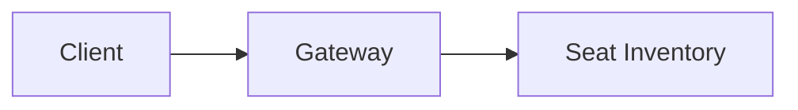

# Next.js + MDX App Migration — Design

**Date:** 2026-08-26
**Status:** Approved, spec-only (no Next.js code written yet — this spec
covers the architecture and the docs/folder migration; the app build
itself is separate follow-up work)
**Supersedes:** the "Format" and "Repository structure" sections of
[2026-08-26-system-design-course-outline-design.md](2026-08-26-system-design-course-outline-design.md).
That file is left unedited as the historical record of the original
decision — this spec is the authoritative one going forward. Everything
else in that spec (scope, topic lists, lesson template content, build
priority order) is unaffected and still governs.
**Amends implementation medium for:**
[2026-08-26-case-study-lesson-format-and-ticketmaster-design.md](2026-08-26-case-study-lesson-format-and-ticketmaster-design.md).
Its content plan (the enhanced lesson template, the checklist-first
workflow, Ticketmaster's HLD/LLD outline) is entirely unaffected — only
the output format changes: `hld.html`/`lld.html` (self-contained
artifacts) become `hld.mdx`/`lld.mdx` (MDX files rendered by this app).
Ticketmaster's `CHECKLIST.md` needs no content changes.
**Superseded (in part) by:**
[2026-08-27-visual-design-system-refresh-design.md](2026-08-27-visual-design-system-refresh-design.md).
That spec is now authoritative for this app's design tokens,
typography, and diagram appearance/color pipeline (the "Design tokens"
and diagram-related sections below are historical — read the refresh
spec instead). This spec's component contracts (`DiagramPanel`,
`QuizItem`, `Rubric`, `SectionTracker`, etc.) and folder structure are
unaffected and still govern.

## Why this changed

The original spec chose self-contained HTML artifacts (published as
Claude Artifacts) because the content is diagram- and interaction-heavy
and Markdown alone renders that poorly. That reasoning still holds — but
requirements grew: the course should be a real app with cross-lesson
search and navigation, publicly shareable at a stable URL, and able to
grow accounts/DB/payments later without a framework migration. Individual
self-contained artifacts can't provide shared navigation or search across
lessons, and duplicate the same theme/quiz/nav boilerplate into every
file (no single place to fix or improve it later). A Next.js app resolves
all three: shared layout, static search, and a plain Next.js backend
available to grow into later.

## Tech stack

- **Next.js** (App Router, TypeScript) — the app framework
- **Tailwind CSS** — styling, driven by the design tokens below
- **shadcn/ui** — unstyled, accessible primitives (accordion, checkbox,
  tabs, dialog) copied into the repo via its CLI, not a themed component
  library — keeps full control of the visual identity
- **MDX** (`@next/mdx` + `gray-matter` for frontmatter) — lesson content
- **Mermaid** — diagrams, rendered client-side inside a `DiagramPanel`
  component
- **fuse.js** — client-side fuzzy search over a static, build-time JSON
  index — no server or database needed for search
- **Vercel** — hosting; zero-config for Next.js, free tier, public URL

No Contentlayer or similar heavier content-abstraction library — a small
hand-written loader (`lib/content.ts`) keeps the dependency surface
minimal, in line with the "low maintenance" goal from the earlier
brainstorm.

## Design system

**Color** — cool paper ground, not warm cream; a signal-teal accent
distinct from generic SaaS blue/purple; semantic seat-state colors
double as domain vocabulary for case studies like Ticketmaster:
- `--ground`: `#F5F7FA` light / `#0B0D12` dark
- `--surface` (panels): `#FFFFFF` light / `#12151C` dark
- `--ink`: `#14171F` light / `#E7E9F0` dark
- `--ink-muted`: `#4B5262` light / `#9BA3B4` dark
- `--accent`: `#0E7C86` light / `#34C7B8` dark
- `--line` (hairline borders): `#D8DEE6` light / `#262B36` dark
- `--state-available`: `#2F9E44` light / `#4ADE80` dark
- `--state-held`: `#C97A1A` light / `#F5A623` dark
- `--state-booked`: `#B23A48` light / `#F87171` dark

**Type** — IBM Plex Mono (headings, labels, state names — a schematic,
blueprint feel that fits "system design") paired with Source Serif 4
(body prose — readable across long explanations). Both via Google Fonts.
Deliberately not Inter/Space Grotesk or a cream+serif+terracotta combo.

**Layout** — a "spec sheet" layout: a readable ~68ch prose column, with
diagrams/quizzes/rubrics breaking into hairline-bordered panels carrying
an uppercase mono eyebrow label (e.g. "ARCHITECTURE", "TRADE-OFF",
"STATE MACHINE"). A slim top bar (title, module switch, theme toggle,
search trigger) and a horizontal section tracker showing progress through
the six fixed template sections.

## Folder structure

```
system-design/                              (repo root = Next.js app root)
├── app/                                     Next.js App Router
│   ├── layout.tsx                           root layout: fonts, theme provider
│   ├── page.tsx                             home/landing page
│   ├── globals.css                          Tailwind + design tokens
│   ├── (site)/                              route group: shared nav chrome
│   │   ├── layout.tsx                       top bar + sidebar + search trigger
│   │   ├── hld/[slug]/page.tsx
│   │   ├── lld/[slug]/page.tsx
│   │   ├── case-studies/[system]/hld/page.tsx
│   │   ├── case-studies/[system]/lld/page.tsx
│   │   └── interview-prep/[slug]/page.tsx
│   └── search/page.tsx
│
├── content/                                 MDX lesson content — mirrors
│   │                                        the existing module numbering
│   ├── 02-high-level-design/concepts/*.mdx
│   ├── 03-low-level-design/concepts/*.mdx
│   ├── 04-case-studies/
│   │   ├── SYLLABUS.md
│   │   └── ticketmaster/{CHECKLIST.md, hld.mdx, lld.mdx}
│   ├── 05-interview-prep/*.mdx
│   └── 06-future-modules.md
│
├── components/
│   ├── ui/                                  shadcn/ui primitives
│   ├── lesson/                              Quiz.tsx, Rubric.tsx,
│   │                                        DiagramPanel.tsx, SelfScoreBand.tsx,
│   │                                        SectionTracker.tsx
│   ├── nav/                                 Sidebar.tsx, TopBar.tsx, ThemeToggle.tsx
│   └── search/SearchDialog.tsx
│
├── lib/
│   ├── mdx-components.tsx                   maps MDX elements to components/lesson/*
│   ├── content.ts                           reads content/, builds nav tree + metadata
│   └── search-index.ts                      build-time static index -> public/search-index.json
│
├── docs/superpowers/{specs,plans}/          unchanged — process docs, not app content
├── SYLLABUS.md, CLAUDE.md                   stay at root, updated for the new format
└── package.json, next.config.ts, tsconfig.json, public/
```

`01-fundamentals/` does not exist yet (placeholder only, per
`06-future-modules.md`) — nothing to migrate for it; it gets created
under `content/` if and when it's actually built.

## Component contracts

- **`<DiagramPanel title="..." type="architecture|class|state|sequence">`**
  — wraps a Mermaid code block, renders a bordered panel with a mono
  uppercase eyebrow label matching `type`
- **`<QuizItem question="..." answer="..." />`** — click-to-reveal Q&A
  card with a one-line explanation; used inline after major concepts and
  in the closing recap quiz
- **`<Rubric items={string[]}>`** — self-tick checklist for the open
  design challenge, computing a live self-score band (Novice / Practicing
  / Interview-ready) from how many items are checked
- **`<SectionTracker sections={string[]} active={string}>`** — horizontal
  progress rail for the six-part lesson template, rendered once per page

## Content authoring pattern

A lesson is one `.mdx` file with frontmatter and the six-part template as
Markdown headings, with the components above embedded at the relevant
points:

```mdx
---
title: "Ticketmaster — High-Level Design"
module: "04-case-studies/ticketmaster"
---

## The stampede problem

A hundred thousand people click "buy" on the same show in the same
second. Every seat must sell exactly once.

<DiagramPanel type="architecture" title="Request flow">

</DiagramPanel>

<QuizItem
  question="Why is a Redis TTL lock preferred over a plain DB row lock?"
  answer="It expires automatically if the buyer abandons checkout."
/>

## Practice & Self-Check

<Rubric items={["Covers the seat-hold TTL and its expiry path"]} />
```

Every element in the MDX (including plain paragraphs and headings) is
mapped to a styled component via `lib/mdx-components.tsx`, so the design
system applies automatically — no per-lesson styling work.

## Search

`lib/search-index.ts` builds a static `public/search-index.json` at
build time from `content/`'s frontmatter and headings. `SearchDialog.tsx`
loads it client-side and queries it with `fuse.js` (fuzzy match). No API
route, no database — stays fully static like the rest of the site.

## Explicitly deferred (not built now)

No `app/api/`, no auth, no database, no payments. When any of these
becomes real work: auth via Auth.js/Clerk, payments via Stripe, and a
database via Prisma/Drizzle all bolt on as standard Next.js patterns
(`app/api/*` route handlers, a future `(app)/dashboard` route group) —
the docs-content side of the app never needs to know they exist. Not
scaffolding placeholders for these now (YAGNI); the structure above
already has an obvious home for them later.

## Migration plan (docs + folders only — no app code yet)

1. `git mv` these five into `content/`, preserving all file contents
   verbatim: `02-high-level-design/`, `03-low-level-design/`,
   `04-case-studies/` (including `SYLLABUS.md` and
   `ticketmaster/CHECKLIST.md`), `05-interview-prep/`,
   `06-future-modules.md`.
2. Fix every relative link that now crosses the new `content/` boundary:
   - `content/02-high-level-design/SYLLABUS.md`,
     `content/03-low-level-design/SYLLABUS.md`,
     `content/05-interview-prep/SYLLABUS.md`,
     `content/04-case-studies/SYLLABUS.md`: their `../SYLLABUS.md` link
     to the root syllabus becomes `../../SYLLABUS.md` (one directory
     deeper now).
   - `content/04-case-studies/ticketmaster/CHECKLIST.md`: its links to
     the root `SYLLABUS.md` and to `docs/superpowers/specs/...` each gain
     one more `../`; its link to `content/04-case-studies/SYLLABUS.md`
     (a sibling within the same subtree) is unaffected.
   - Root `SYLLABUS.md`: every link to a module syllabus/file gains a
     `content/` prefix.
3. Update `CLAUDE.md`'s "Writing the lesson" section: lessons are now MDX
   files under `content/<module>/`, authored with the components above,
   previewed locally via `npm run dev`, deployed to Vercel — not
   self-contained HTML artifacts published via Claude Artifacts. The
   `artifact-design` skill reference is dropped (no longer applicable);
   the design-system tokens above are the reference instead. The
   checklist-first workflow, research-before-drafting rule, and lesson
   template content are unchanged.
4. Add a one-line pointer at the top of `CLAUDE.md`'s scope reference
   noting the original spec's Format section is superseded by this doc.

No lesson content exists yet to migrate (`04-case-studies/ticketmaster/CHECKLIST.md`
is a plan, not a rendered lesson), so this migration is pure
folder/link mechanics — no HTML-to-MDX content conversion is needed.

## Not in this spec

Actually scaffolding the Next.js project (`package.json`, `app/`,
`components/`, `lib/`, Tailwind/shadcn setup) and building Ticketmaster's
first real `hld.mdx`/`lld.mdx` are separate follow-up work, planned and
executed after this migration lands.
